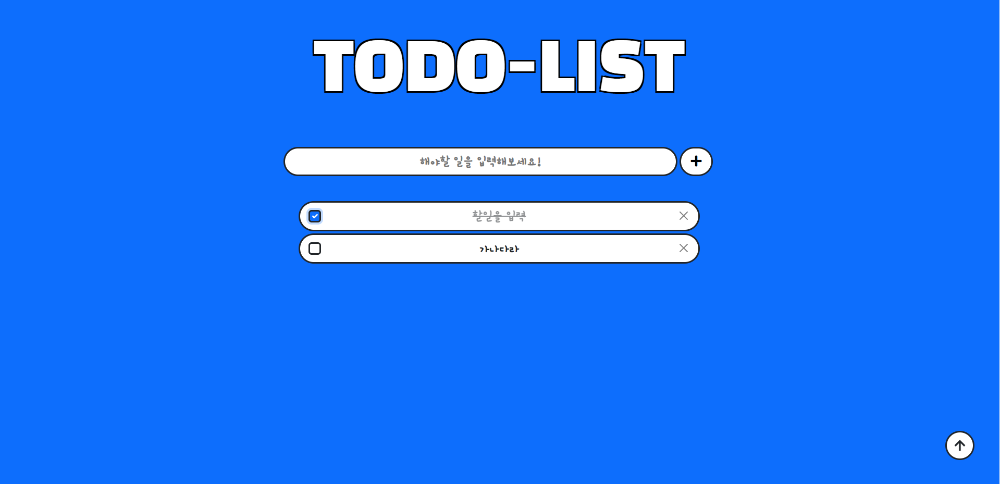
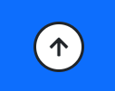
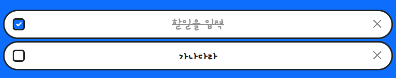

# Todo_list (ver.1.0.1)

> 긴 추석 연휴 뭐라도 해보자! 
>
> Todo-list 너로 정했다.

**개발 기간** : 2021-09-20 ~2021-09-21

**목표** : 할일 추가, 삭제, 수정 및 체크 완료 체크시 줄 긋기!


## 프로젝트 개요 

 첫 토이프로젝트로 Todo-List를 선택한 이유는 다음과 같다.

1. 개발 초보들의 첫 프로젝트로 가장 보편적이고 쉬운 프로젝트로 잘 알려져있어서 선택하였다. 

   교육과정 중에 무리가 가지않으면서도, 내가 배운 것들을 적절히 이용할 수 있는 프로젝트로 딱이라고 생각했다. 

   쉽고 남들이 다 한번 쯤은 해보는 프로젝트지만, 기능을 추가해 나가면서 살을 붙여가면 좋은 웹 앱으로 발전시킬 수 있을 것이라고 믿어 의심치 않는다! 

2. 다른 Todo-List를 사용했을 때 불편하다는 생각을 자주 했었다. 

   워낙 게으른 탓에 Todo-List를 사용하였었는데, Todo-List를 작성하는 것 마저 귀찮더라.. 

   그래서, Todo-List에도 자동화 기능을 추가할 수 있으면 좋겠다는 생각을 했었다. 많이 사용해본 만큼 좋은 서비스를 만들어 낼 수 있을 것이라고 생각한다.  

   >  그리고 직접 만들어 쓰면 더 자주 이용하겠지 하는 마음으로.. ㅎㅎ ...


## Stack

* 언어 : python
* 프레임워크 : django
* 라이브러리 : bootstrap5
* DB : sqltie3

> 현재까지 배웠던 것들을 총 동원하여 프로젝트를 진행하였다.


# V 1.0.1

### 결과물



> 할일을 완료할 시 체크를 통해서 line-through 되는 효과를 구현하였다. 
>
> 문제는 새로고침시 날아간다.. cookie나 session 을 통해서 처리해야할 것 같은데 아직은 어떻게 하는지 모르겠다.. 
>
> 구글링을 해보니 js를 이용해야하더라 ㅠㅠㅠ 공부가 필요한 부분인 것 같다..
>
>  
>
> 우측하단에는 투두리스트의 상단으로 바로 갈 수 있는 버튼을 구현하였다. 
>
> 이것도 js 를 통해서 구현해야하는 건 줄 알았지만 a tag로 간단하게 구현이 가능한 기능이었다. 굳굳


### 맨위로 가기 버튼 추가



```html
<a class="fixed-bottom m-5 ms-auto d-flex bg-white border rounded-circle border-3 border-dark circle justify-content-center align-items-center text-decoration-none text-dark fs-4" href="#"><i class="fas fa-arrow-up"></i></a>
```

* base.html에 코드 추가
  * 처음의 걱정과는 다르게 단 한줄의 코드로 생성할 수 있었다. 
  * 그냥 a tag를 통해서 현재페이지로 redirect 시키는 느낌으로 구현하면 되는 초간단 기능..
* fixed 를 통해 사용자가 어떤 화면을 보고있든 우측하단에 고정될 수 있도록 하였다.


### 체크박스 기능 추가



```django
  
# CSS
  .form-check-input:checked + .form-checked-content {
    text-decoration: line-through;
    opacity:.5;
  }

# 코드 추가 내용
<input class="form-check-input m-0 border border-3 border-dark" type="checkbox" value="" style="font-size: 1.5rem;">
<p class="ms-auto mb-0 fs-4 fw-bold listfont form-checked-content">
    {{ list.todo }}
</p>
```

* :checked 가상 선택자를 이용하여 체크 시 줄이 쳐지는 기능을 구현하였다.
  * 여기에는 치명적인 문제점이 하나 존재하는데, 새로고침을 할 경우 기존의 체크가 반영이 되지 않는 다는 것이다... 
  * 아직까지 이를 해결할 명확한 아이디어가 없어서 고민이다. 
    * 구글링을 통해 알아보니 JS를 이용해야하는 것 같다.. ㅠㅠ 

***


# V 1.0.0

## 결과물


> 최대한 직관적으로 제작하였다. 
>
> 할일을 입력하면 DB에 저장되고, 저장된 데이터를 바탕으로 해야할 일 목록을 현재페이지에서 redirect 해준다. 
>
> 'x' 표시를 누르면 DB에서 삭제되고, 목록을 지워주며 현재페이지가 redirect 된다. 


## models

> 초 간단 모델...

```python
from django.db import models

# Create your models here.
class List(models.Model):

    todo = models.CharField(max_length=100)

    def __str__(self):
        return self.todo
```

* 작성되는 정보의 글자수를 100글자로 제한해주었다. 
  * ~~100글자 넘게 써야할 일이 있다면 참으로 안타깝다.~~
* 매직메서드를 이용해서 쿼리를 조회하였을 때, 해야할 일을 str 형태로 바로 보이게끔 해주었다.
* 추후에 등록날짜, 마감기한 등을 추가할 예정이다.


## views

```python
from django.shortcuts import redirect, render
from .models import List
from django.views.decorators.http import require_http_methods, require_POST, require_safe

@require_safe
def index(request):
    lists = List.objects.all()
    context = {
        'lists' : lists
    }
    return render(request, 'lists/index.html', context)

@require_http_methods(['GET', 'POST'])
def create(request):
    if request.method == "POST":
        todo = request.POST.get("todo")
        if 0 < len(todo) <= 100:
            todolist = List(todo=todo)
            todolist.save()
    return redirect('lists:index')
        

@require_POST
def delete(request, pk):
    if request.method == "POST":
        todolist = List.objects.get(pk=pk)
        todolist.delete()
    return redirect('lists:index')
```

### index

* 'CRUD' 중 R을 담당하는 부분이다. 

* List에 저장된 데이터 모두를 불러온 후, index 페이지에서 조회할 수 있게끔 context에 담아 render하는 역할을 한다.

* `require_safe` 데코레이터를 달아주어, get 요청이 아닌 다른 방식으로 접근했을 경우 405에러가 발생하도록 하였다.


### create

* 말 그대로 Create를 담당하는 부분이다.

* DB를 조작하는 행위이므로, POST요청일 때만 작동하기 위해 if 문으로 분기를 진행하였다. 
  * POST요청이 아닐 경우 아무런 동작을 하지 않고, index 페이지로 redirect 된다.
  * POST 요청일 경우, 입력받은 데이터의 유효성 검사를 진행하였다. 
    * model에서 maxlength 를 100으로 지정해놓기는 하였지만, 혹시모를 상황에 대비하여 한번 더 글자수를 검사하였다.
    * 유효성 검사를 통과할 경우, 입력받은 정보를 바탕으로 새로운 DB를 생성하고 저장한다.
* `require_http_methods` 를 통해서 GET요청과 POST 요청 이외에는 405에러가 발생하도록 하였다.
  * 이 부분은 사실 create form 을 따로 렌더하는 페이지가 없기때문에, POST요청만 받아도 될 듯하다 ㅎㅎ..


### delete

* 할 일 목록을 삭제하는 Delete를 담당하는 부분이다.
* 마찬가지로, POST일 때만 동작하도록 하였다. 
  * decorator 를 달아주었기 때문에 if 문으로 분기하지 않아도 되지만, 코딩의 흐름상 if문을 달면서 코딩을 진행하였다 

* 지우고자 하는 할일 데이터의 pk 값을 variable routing 형태로 넘겨받는다. 
  * 그 후, DB에서 해당 pk 값을 가진 쿼리를 삭제한다.


## Templates

### base.html

```django
<!DOCTYPE html>
<html lang="ko">
<head>
  <meta charset="UTF-8">
  <meta http-equiv="X-UA-Compatible" content="IE=edge">
  <meta name="viewport" content="width=device-width, initial-scale=1.0">
  <title>Todolist</title>
  <style>
    
    
  </style>
   타이틀글씨 
  <link rel="preconnect" href="https://fonts.googleapis.com">
  <link rel="preconnect" href="https://fonts.gstatic.com" crossorigin>
  <link href="https://fonts.googleapis.com/css2?family=Black+Han+Sans&display=swap" rel="stylesheet">
  
   리스트글씨 
  <link rel="preconnect" href="https://fonts.googleapis.com">
  <link rel="preconnect" href="https://fonts.gstatic.com" crossorigin>
  <link href="https://fonts.googleapis.com/css2?family=Gamja+Flower&display=swap" rel="stylesheet">
  
  <!-- CSS only -->
  <link href="https://cdn.jsdelivr.net/npm/bootstrap@5.1.1/dist/css/bootstrap.min.css" rel="stylesheet" integrity="sha384-F3w7mX95PdgyTmZZMECAngseQB83DfGTowi0iMjiWaeVhAn4FJkqJByhZMI3AhiU" crossorigin="anonymous">

</head>
<body class="bg-primary">
  <div class="container">
    
    
  </div>
</body>
<!-- JavaScript Bundle with Popper -->
<script src="https://cdn.jsdelivr.net/npm/bootstrap@5.1.1/dist/js/bootstrap.bundle.min.js" integrity="sha384-/bQdsTh/da6pkI1MST/rWKFNjaCP5gBSY4sEBT38Q/9RBh9AH40zEOg7Hlq2THRZ" crossorigin="anonymous"></script>
<script src="https://kit.fontawesome.com/bdb0b13ac7.js" crossorigin="anonymous"></script>
</html>
```

* 모든 템플릿에서 기본으로 사용할 base.html 이다. 

* 각종 CDN을 불러오고, bg-color를 지정해주었다. 

* head 에는 각 템플릿에 따로 적용될 css 를 입력할 수 있는 block을, body 에는 각 템플릿 마다 담길 content block을 생성해주었다.

  * 사실.. 현재까지 만든 버젼에서는 index 페이지에서 모든 것을 조작하기 때문에 base 템플릿이 필요없다 ㅎㅎ...

    * 하지만 확장을 생각하면.. 잘한거 겠지..??

    

### index.html

```django


  .headtitle {
    font-size: 8rem;
    font-family: 'Black Han Sans', sans-serif;
  }
  .wording-box{
    height: 3.5rem;
  }

  .text-outline {
      color: #f00;
      text-shadow:
      -3px -3px 0 #000,
      3px -3px 0 #000,
      -3px 3px 0 #000,
      3px 3px 0 #000;  
  }

  .submit-button{
    width:4rem;
  }

  .listfont {
    font-family: 'Gamja Flower', cursive;
  }

  input{
    outline:none;
  }




  <div class="row justify-content-center mb-5">
    <p class="text-center headtitle m-5 text-white text-outline"> TODO-LIST</p>
    <form class="d-flex justify-content-center" action="" method="POST">
      
      <input class="col-7 border rounded-pill border-3 border-dark wording-box bg-white text-center listfont fs-4 fw-bold" type="text" autofocus maxlength="100" placeholder="해야할 일을 입력해보세요!" name="todo" autocomplete='off'>
      <button class="mx-1 border border-3 border-dark rounded-pill submit-button bg-white"><i class="fas fa-plus fs-4"></i></button>
    </form>
  </div>

  <div class="row justify-content-center">
    
      <div class="col-7 list-group pe-0">
        
          <li type="button" class="d-flex justify-content-center align-items-center list-group-item list-group-item-action border rounded-pill border-3 border-dark mb-1">
            <p class="ms-auto mb-0 fs-4 fw-bold listfont">
              {{ list.todo }}
            </p>
            <form class="ms-auto" action="" method="POST">
              
              <button class="btn-close" aria-label="Close"></button>
            </form>
          </li>
        
      </div>
    
  </div>


```

* 새로운 것들을 조금 시도해보았다. 

  * 타이틀에 outline을 넣어주었다. 
    * outline 이 없을 때는 굉장히 밋밋한 느낌이었는데,  추가하고 나서는 어딘지 모르게 임팩트가 있어졌다.

  * 버튼에 글자대신 아이콘을 추가해주었다. 
    * 심플하면서도 직관성있는 페이지를 보여주고 싶어서 아이콘을 선택하였다. 

* 부트스트랩 components 를 응용하여 디자인하였다. 
  * 이전까지는 주어진 형태를 그대로 가져다 쓰기에 바빴지만, 이번에는 내가 필요한 것들만 조합하여 내가 원하는 디자인을 만들어내었다.


## 실패한 것들

* 리스트를 클릭할 경우 modal창이 나오고 해야할 일을 수정할 수 있는 기능을 만드려고 했으나, 현재 작성되어 있는 내용을 redirect(?) 하는 것을 하지 못하여서 일단 접어두었다 ㅠㅠ 
* 체크박스를 만들고 그것을 체크하면 할일 목록에 취소선이 그어지도록 하려고 했지만, 체크를 인식하고 바로 redirect하는 것을 어떻게 해야할 지 모르겠어서 패스.. 


## 추후 계획

* 남은 추석 기간 동안에 수정 기능 및 체크박스 기능 구현하기!! 
* 매일 반복되는 할일, 주마다 반복되는 할일, 월마다 반복되는 할일 등을 설정하여 하루, 주, 월이 시작될 때 자동으로 할일 생성되게끔 해주는 기능 추가! 
* 오늘 하지 못한 일을 자동으로 내일로 넘겨주는 기능추가!
  * 오래된 순으로 표시해주기! 
* 마감일이 다가오는 할일은 알림주는 기능 추가
