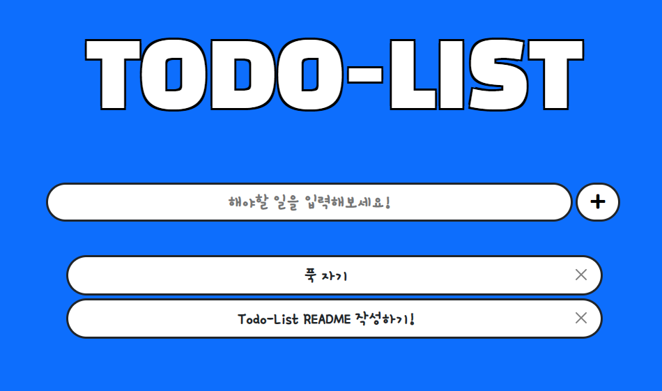

# Todo_list (ver.1.0.0)

> 긴 추석 연휴 뭐라도 해보자! 
>
> To do list 너로 정했다.

**개발 기간** : 2021-09-20 ~2021-09-20 (ing)

**목표** : 할일 추가, 삭제, 수정 및 체크 완료 체크시 줄 긋기!


## Stack

* 언어 : python
* 프레임워크 : django
* 라이브러리 : bootstrap5

* DB : sqltie3


## 결과물




## models


## views

```python
from django.shortcuts import redirect, render
from .models import List
from django.views.decorators.http import require_http_methods, require_POST, require_safe

@require_safe
def index(request):
    lists = List.objects.all()
    context = {
        'lists' : lists
    }
    return render(request, 'lists/index.html', context)

@require_http_methods(['GET', 'POST'])
def create(request):
    if request.method == "POST":
        todo = request.POST.get("todo")
        if 0 < len(todo) <= 100:
            todolist = List(todo=todo)
            todolist.save()
    return redirect('lists:index')
        

@require_POST
def delete(request, pk):
    if request.method == "POST":
        todolist = List.objects.get(pk=pk)
        todolist.delete()
    return redirect('lists:index')
```

### index

* 'CRUD' 중 R을 담당하는 부분이다. 

* List에 저장된 데이터 모두를 불러온 후, index 페이지에서 조회할 수 있게끔 context에 담아 render하는 역할을 한다.

* `require_safe` 데코레이터를 달아주어, get 요청이 아닌 다른 방식으로 접근했을 경우 405에러가 발생하도록 하였다.


### create

* 말 그대로 Create를 담당하는 부분이다.

* DB를 조작하는 행위이므로, POST요청일 때만 작동하기 위해 if 문으로 분기를 진행하였다. 
  * POST요청이 아닐 경우 아무런 동작을 하지 않고, index 페이지로 redirect 된다.
  * POST 요청일 경우, 입력받은 데이터의 유효성 검사를 진행하였다. 
    * model에서 maxlength 를 100으로 지정해놓기는 하였지만, 혹시모를 상황에 대비하여 한번 더 글자수를 검사하였다.
    * 유효성 검사를 통과할 경우, 입력받은 정보를 바탕으로 새로운 DB를 생성하고 저장한다.
* `require_http_methods` 를 통해서 GET요청과 POST 요청 이외에는 405에러가 발생하도록 하였다.
  * 이 부분은 사실 create form 을 따로 렌더하는 페이지가 없기때문에, POST요청만 받아도 될 듯하다 ㅎㅎ..


### delete

* 할 일 목록을 삭제하는 Delete를 담당하는 부분이다.
* 마찬가지로, POST일 때만 동작하도록 하였다. 
  * decorator 를 달아주었기 때문에 if 문으로 분기하지 않아도 되지만, 코딩의 흐름상 if문을 달면서 코딩을 진행하였다 

* 지우고자 하는 할일 데이터의 pk 값을 variable routing 형태로 넘겨받는다. 
  * 그 후, DB에서 해당 pk 값을 가진 쿼리를 삭제한다.

